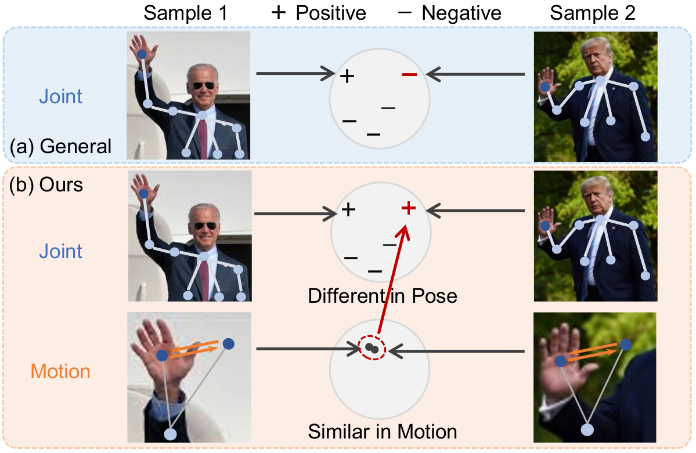

# CrosSCLR

The Official PyTorch implementation of **"3D Human Action Representation Learning via Cross-View Consistency Pursuit"** in CVPR 2021. The arXiv version of our paper is coming soon.

<div align=center>
    
</div>

## Requirements
We only test our code on the following environment:
  - Python == 3.8.2
  - PyTorch == 1.4.0
  - CUDA == 11.1

## Installation
  ```bash
  # Install python environment
  $ conda create -n crossclr python=3.8.2
  $ conda activate crossclr

  # Install PyTorch
  $ pip install torch==1.4.0

  # Download our code
  $ git clone https://github.com/LinguoLi/CrosSCLR.git
  $ cd CrosSCLR

  # Install torchlight
  $ cd torchlight
  $ python setup.py install
  $ cd ..

  # Install other python libraries
  $ pip install -r requirements.txt
  ```

## Data Preparation
- We use [NTU RGB+D](https://www.cv-foundation.org/openaccess/content_cvpr_2016/papers/Shahroudy_NTU_RGBD_A_CVPR_2016_paper.pdf) and [NTU RGB+D 120](https://arxiv.org/pdf/1905.04757.pdf) as our datasets.
- Please click [here](http://rose1.ntu.edu.sg/Datasets/actionRecognition.asp) for more information about accessing the "NTU RGB+D" and "NTU RGB+D 120" datasets.
- Only the **3D skeleton** modality is required in our experiments, you could also obtain it via [NTURGB-D](https://github.com/shahroudy/NTURGB-D).
- Please put the raw data in the directory `<path to nturgbd+d_skeletons>` and build the NTU RGB+D database as:

  ```bash
  # generate raw database for NTU-RGB+D
  $ python tools/ntu_gendata.py --data_path <path to nturgbd+d_skeletons>

  # preprocess the above data for our method (for limited computing power, we resize the data to 50 frames)
  $ python feeder/preprocess_ntu.py
  ```

## Unsupervised Pre-Training

- Example for unsupervised pre-training of **3s-CrosSCLR**. You can train other models by using other `.yaml` files in `config/` folder.
  ```bash
  # train on NTU-RGB+D xview
  $ python main.py pretrain_crossclr_3views --config config/CrosSCLR/crossclr_3views_xview.yaml
  ```
- The pre-trained models are in the directory: `weights/`

## Linear Evaluation

- Example for linear evaluation of **3s-CrosSCLR**. You can evaluate other models by using other `.yaml` files in `config/linear_eval` folder.
  ```bash
  # evaluate pre-trained model on NTU-RGB+D xview
  $ python main.py linear_evaluation --config config/linear_eval/linear_eval_crossclr_3views_xview.yaml --weights <path to weights>
  # evaluate the provided pre-trained model
  $ python main.py linear_evaluation --config config/linear_eval/linear_eval_crossclr_3views_xview.yaml --weights weights/crossclr_3views_xview_frame50_channel16_cross150_epoch300.pt
  ```
  
 ## Results

The **Top-1 accuracy** results on two datasets for the linear evaluation of our methods are shown here:

| Model          | NTU 60 xsub (%) | NTU 60 xview (%) | NTU 120 xsub (%) | NTU 120 xset (%) |
| :------------- | :-------------: | :--------------: | :--------------: | :--------------: |
| SkeletonCLR    |       68.3      |       76.4       |         -        |        -         |
| 2s-CrosSCLR    |       74.5      |       82.1       |         -        |        -         |
| 3s-CrosSCLR    |       77.8      |       83.4       |        67.9      |       66.7       |

## Visualization

The [**t-SNE**](https://www.jmlr.org/papers/volume9/vandermaaten08a/vandermaaten08a.pdf) visualization of the embeddings during SkeletonCLR and CrosSCLR pre-training.

<div align=center>
    
</div>

---

## Citation
Please cite our paper if you find this repository useful in your resesarch:

```
@inproceedings{li2021crossclr,
  Title          = {3D Human Action Representation Learning via Cross-View Consistency Pursuit},
  Author         = {Linguo, Li and Minsi, Wang and Bingbing, Ni and Hang, Wang and Jiancheng, Yang and Wenjun, Zhang},
  Booktitle      = {CVPR},
  Year           = {2021}
}
```

## Acknowledgement
- The framework of our code is based on the old version of [ST-GCN](https://github.com/yysijie/st-gcn/blob/master/OLD_README.md) (Its new version is [MMSkeleton](https://github.com/open-mmlab/mmskeleton)).
- [Awesome-Skeleton-based-Action-Recognition](https://github.com/niais/Awesome-Skeleton-based-Action-Recognition)
- [mv-ignet](https://github.com/niais/mv-ignet)
- [NTURGB-D](https://github.com/shahroudy/NTURGB-D)
